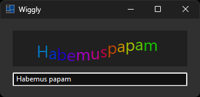

# wiggly

The Wiggly example shows how to animate a user control using timer and [timer::tick](https://gammasoft71.github.io/xtd/reference_guides/latest/classxtd_1_1forms_1_1timer.html#afd416d4174c3a9a9103e4cbd53bd25bf) event. In addition, the example demonstrates how to use [graphics::measure_string](https://gammasoft71.github.io/xtd/reference_guides/latest/classxtd_1_1drawing_1_1graphics.html#a67cfac297284ea0aadb2b9722d68679e) to determine the size of text on screen.

## Sources

* [src/wiggly.cpp](src/wiggly.cpp)
* [CMakeLists.txt](CMakeLists.txt)

## Build and run

Open "Command Prompt" or "Terminal". Navigate to the folder that contains the project and type the following:

```shell
xtdc run
```

## Output

### Windows :




### macOS :


### Gnome :


